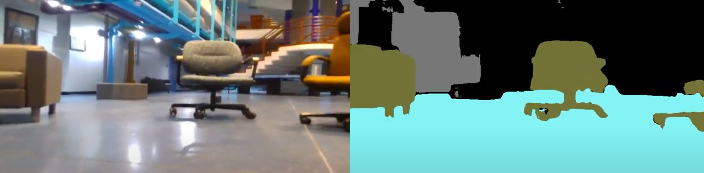

I have participated in research focused on semantic segmentation in images (similar to object detection but is pixel-wise) using neural networks with a focus on robotics. The image below displays a model trained to label chairs, floors, and walls in a realtime video to help the robot navigate indoors.

