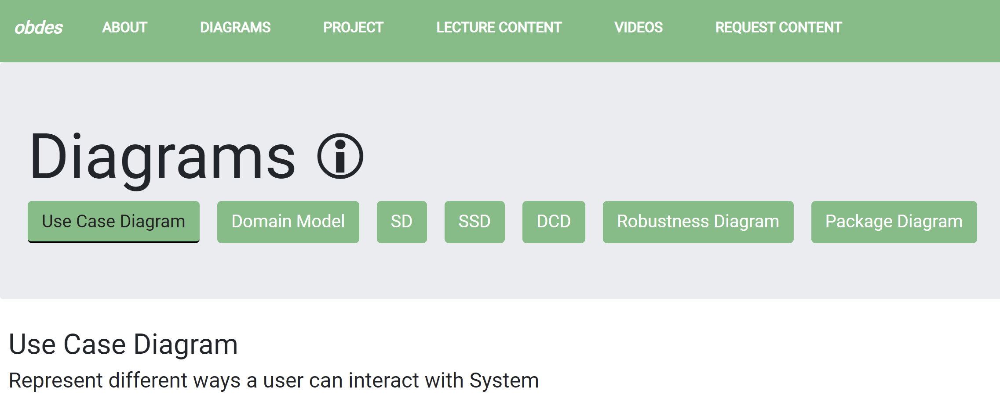

I really enjoy helping other students so I was a Teaching Assistant for a course titled "Objects and Design", providing office hours, grading assignments, and redesigning resources website to assist the students. I spent a lot of time restructuring the newly created class website. I ensured that all of the content was correct, expanded upon explanations of lecture content such as the Unified Process and GRASP. I also wrote 3 example problems for all 7 types of UML diagrams taught in the class with detailed explanations. I was helped immensely by my fellow TAs and it was a joy to work with all of them. My favorite part of being a TA was working with students and helping them on their semester long project.

It is a website that is exclusive to Georgia Tech students, but here is a sneak-peak picture.

