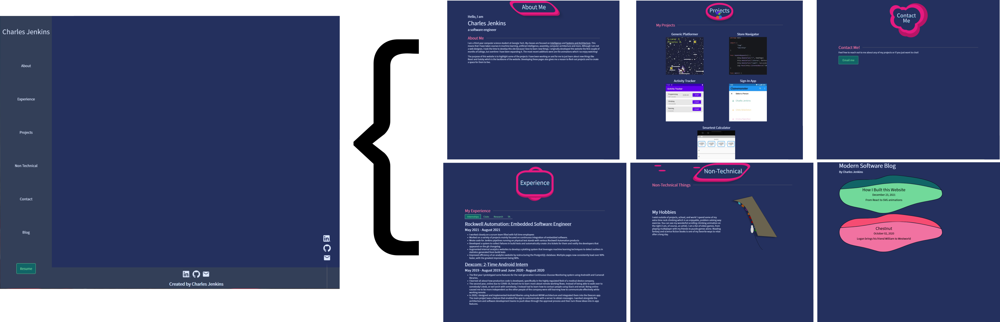

First off, I would like to say that I am not a web designer, but in this post I will detail how I have developed this website and everything I have learned along the way.

## Why I chose Gatsby

I started creating this website as a first year college student and I wanted some way to develop a site without needing a server, but still having all of the useful features of an advanced
library like React. I came across Gatsby when researching other websites and I came across a couple of other people using it. Gatsby started off as a static site generator based on React and
uses GraphQL for data management, but in version 4 started to transition to allow dynamic generation. My needs were simple and Gatsby was more than powerful enough to fit my dreams.'

## Architecture of my site

Architecture is something I really enjoy. This website has been a long running project but I have attempted to shape it in a way that can allow future change. Navigation swaps out the content
of the right-side panel as shown in this image:


This is done using `gatsby-plugin-transition-link` by setting it up to use my custom navigation layout:

````
    {
      resolve: "gatsby-plugin-transition-link",
      options: {
        layout: require.resolve(
          `./src/components/page_items/NavigationLayout.js`
        ),
      },
    }
````

With this simple setup (more information here: https://transitionlink.tylerbarnes.ca/docs/installation/) `NavigationLayout.js` is able to access the contents of the currently selected page simply with `props.children` which can then be manipulated like any other React component to place it in the layout as desired. The added benefit of using transitionlink is that adding animations becomes simple.

## Animations

For the animations I had to learn a lot. 

At the top of each of the main pages (not the blog page) I have an animated title. I have a series of codepens here with the initial designs: https://codepen.io/collection/mrZxeM. They use some advanced (at least to me) CSS keyframes and SVG animations. 

#### CSS keyframes
CSS keyframes can be read more about here: https://developer.mozilla.org/en-US/docs/Web/CSS/@keyframes. The main idea behind them is simple though, an example from the documentation shows:

````
@keyframes identifier {
  0% { top: 0; left: 0; }
  30% { top: 50px; }
  68%, 72% { left: 50px; }
  100% { top: 100px; left: 100%; }
}
````

Which in English says something like "At the start, give this identifier top and left spacing of 0, 30% of the way through the animation set the top spacing to 50px, 68% and 72% through the animation set the left spacing to 50px, and finally at the end set the top spacing to 100px and left spacing to 100%." In order to make the transitions smooth, when you call this keyframe you are able to specify the interpolation method such as with:

````
animation: identifier 5s infinite ease;
````

Which says "Run the keyframes animation on a 5 second loop and instead of just abruptly setting the new css at each interval, apply an easing function to make it look smooth."

#### SVG animations

SVG animations are really cool because they are incredibly portable and highly efficient. Take the "Contact Me" animation for example: https://codepen.io/thecharlesjenkins/pen/wvdBoJW.
<div class="contact_me">
  <svg
     width="100mm"
     height="100mm"
     viewBox="0 0 158 143"
     version="1.1"
     id="svg5"
     xmlns="http://www.w3.org/2000/svg"
     xmlns:svg="http://www.w3.org/2000/svg">
    <g
       id="layer3">
      <circle
         style="fill:#b71566;fill-opacity:1;stroke-width:0.394957"
         id="path1112-1-8"
         cx="88.523994"
         cy="102.25828"
         r="33.814663">
          <animate attributeName="r" values="33;38;33" dur="2.3s" repeatCount="indefinite" />
        </circle>
      <circle
         style="fill:#b71566;fill-opacity:1;stroke-width:0.394957"
         id="path1114-8-6"
         cx="106"
         cy="52.5"
         r="46">
          <animate attributeName="r" values="46;50;46" dur="3s" repeatCount="indefinite" />
         </circle>
      <circle
         style="fill:#b71566;fill-opacity:1;stroke-width:0.394957"
         id="path1116-9-9"
         cx="69"
         cy="105"
         r="27">
          <animate attributeName="r" values="27;36;27" dur="2.5s" repeatCount="indefinite" />
         </circle>
    </g>
    <g
       id="layer2">
      <circle
         style="fill:#e51a80;fill-opacity:1;stroke-width:0.337439"
         id="path1104-4"
         cx="31"
         cy="36.5"
         r="23" >
          <animate attributeName="r" values="23;26;23" dur="2.8s" repeatCount="indefinite" />
         </circle>
      <circle
         style="fill:#e51a80;fill-opacity:1;stroke-width:0.337439"
         id="path1108-3"
         cx="57.363815"
         cy="45.335594"
         r="25.680174" />
      <circle
         style="fill:#e51a80;fill-opacity:1;stroke-width:0.337439"
         id="path1110-8"
         cx="41"
         cy="71"
         r="30.5" >
          <animate attributeName="r" values="30.5;33;30.5" dur="2.3s" repeatCount="indefinite"/>
         </circle>
      <circle
         style="fill:#e51a80;fill-opacity:1;stroke-width:0.337439"
         id="path1112-1"
         cx="84.5"
         cy="92"
         r="29">
          <animate attributeName="r" values="29;33;29" keyTimes="0; 0.6; 1" dur="2.3s" repeatCount="indefinite"/>
         </circle>
      <circle
         style="fill:#e51a80;fill-opacity:1;stroke-width:0.337439"
         id="path1114-8"
         cx="99.896584"
         cy="49.348145"
         r="39.322769" />
      <circle
         style="fill:#e51a80;fill-opacity:1;stroke-width:0.337439"
         id="path1116-9"
         cx="67.796394"
         cy="94.288383"
         r="23.272659" />
    </g>
    <g
       id="layer1">
      <circle
         style="fill:#24305e;fill-opacity:1;stroke-width:0.264583"
         id="path1104"
         cx="39"
         cy="44"
         r="18" >
          <animate attributeName="r" values="18;22;18" keyTimes="0; 0.4; 1" dur="2.8s" repeatCount="indefinite"/>
         </circle>
      <circle
         style="fill:#24305e;fill-opacity:1;stroke-width:0.264583"
         id="path1108"
         cx="60.135384"
         cy="51.125916"
         r="20.135592" />
      <circle
         style="fill:#24305e;fill-opacity:1;stroke-width:0.264583"
         id="path1110"
         cx="47.550636"
         cy="71.261505"
         r="23.911016" />
      <circle
         style="fill:#24305e;fill-opacity:1;stroke-width:0.264583"
         id="path1112"
         cx="81.529442"
         cy="87.621696"
         r="22.652542" />
      <circle
         style="fill:#24305e;fill-opacity:1;stroke-width:0.264583"
         id="path1114"
         cx="93.5"
         cy="54"
         r="31" >
          <animate attributeName="r" values="31;33;31" keyTimes="0; 0.65; 1" dur="3.1s" repeatCount="indefinite"/>
         </circle>
      <circle
         style="fill:#24305e;fill-opacity:1;stroke-width:0.264583"
         id="path1116"
         cx="68.315468"
         cy="89.509392"
         r="18.247881" />
          <text
       xml:space="preserve"
       style="font-style:normal;font-weight:normal;font-size:10.5833px;line-height:1.25;font-family:sans-serif;letter-spacing:0px;word-spacing:0px;fill:#dce7ff;fill-opacity:1;stroke:none;stroke-width:0.264583"
       x="42.788136"
       y="67.957634"
       id="text9109"><tspan
         sodipodi:role="line"
         id="tspan9107"
         x="42.788136"
         y="67.957634">Contact Me</tspan></text>
    </g>
  </svg>
<div>

It is implemented in pure HTML yet is able to be dynamic.

Here is a simple example:

<svg>
      <circle
         style="fill:#e51a80"
         cx="22"
         cy="22"
         r="18">
          <animate attributeName="r" values="18;22;18" keyTimes="0; 0.4; 1" dur="2.8s" repeatCount="indefinite"/>
         </circle>
</svg>

```
<svg>
      <circle
         style="fill:#e51a80"
         cx="22"
         cy="22"
         r="18">
          <animate attributeName="r" values="18;22;18" keyTimes="0; 0.4; 1" dur="2.8s" repeatCount="indefinite"/>
         </circle>
</svg>
```

I gave it a fill of "#e51a80" to give that bluish color, it is offset by 22 in the x and y direction since the maximum radius is 22, and has an initial radius of 18. Then comes the animation,
It is specified that it will animate the radius which is given by `attributeName="r"`, it will animate between radii of size "18;22;18" on the time intervals of "0; 0.4; 1" and one iteration will take 2.8s and will repeat forever.

With this incredibly simple but powerful tool, any SVG is able to be animated. Here only one attribute is animated, but the same ideas can be expanded to multiple attributes simultaneously.

#### Transition Animations

Finally for the transition animations between pages I used GSAP: https://greensock.com/gsap/. GSAP combined with navigationlink is very powerful and I am able to do something like:

````
const enterAnimation = (animationRef, bodyRef, pageRef) => {
  let timeline = gsap.timeline()
  timeline.to(pageRef, { rotate: 45 }, 0)
  timeline.to(pageRef, { opacity: 1 })
  timeline.from(bodyRef, { x: "-100vw" })
  timeline.from(animationRef, { x: "-100vw" })
  timeline.to(pageRef, { rotate: 0 })
  return timeline
}

const exitAnimation = (animationRef, bodyRef, pageRef) => {
  let timeline = gsap.timeline()
  timeline.to(pageRef, { rotation: 45 })
  timeline.to(animationRef, { x: "100vw" })
  timeline.to(bodyRef, { x: "100vw" })
  return timeline
}
````

To apply a series of animation on enter and exit and then feed those into navigationlink to apply when a page is navigated to or away from.

## Main Pages

For the main pages I have written up each section in Markdown. Take the experience section for example, the file structure is:

````
- experience
    - clubs
        - roboracing.md
    - internships
        - dexcom.md
        - rockwell.md
    - research
        - VIP.md
````

Using this stucture, it can be queried with:

````
export const query = graphql`
  query {
    internships: allMarkdownRemark(
      sort: { fields: [frontmatter___order], order: ASC }
      filter: { fileAbsolutePath: { regex: "/experience/internships/" } }
    ) {
      edges {
        node {
          frontmatter {
            company
            title
            link
            dates
          }
          html
        }
      }
    }
    clubs: allMarkdownRemark(
      filter: { fileAbsolutePath: { regex: "/experience/clubs/" } }
    ) {
      edges {
        node {
          frontmatter {
            title
          }
          html
        }
      }
    }
    research: allMarkdownRemark(
      filter: { fileAbsolutePath: { regex: "/experience/research/" } }
    ) {
      edges {
        node {
          frontmatter {
            title
          }
          html
        }
      }
    }
    ta: allMarkdownRemark(
      filter: { fileAbsolutePath: { regex: "/experience/ta/" } }
    ) {
      edges {
        node {
          frontmatter {
            title
          }
          html
        }
      }
    }
  }
`
````

Then the main React component is able to take all of this HTML data and format it into the tabs seen on the experience page.

## Blog

Finally I want to talk about the blog. For the blog I wanted it to look a little different so I didn't go with a neat title animation and just did a more straightforward text header but spiced it up a bit with the colorful buttons. In order to query for all of the available blog articles, I created a GraphQL resolver as:

````
exports.createResolvers = ({ createResolvers }) => {
  const resolvers = {
    Query: {
      allBlogPosts: {
        type: ["MarkdownRemark"],
        resolve: async (source, args, context, info) => {
          const { entries } = await context.nodeModel.findAll({
            type: "MarkdownRemark", query: {
              limit: args.limit, skip: args.skip, filter: {
                fileAbsolutePath: { regex: "/blog/" }
              },
            }
          })
          return entries
        },
      },
    },
  }
  createResolvers(resolvers)
}
````

Which creates a new GraphQL endpoint so that I can query:

````
  const result = await graphql(`
    query {
      allBlogPosts {
        frontmatter {
          title
          date(formatString: "MMMM DD, YYYY")
          brief
        }
        html
        parent {
          ... on File {
            name
          }
        }
      }
    }
  `)
````

To get all of the available blog posts! How neat is that? I have all of the blogs inside of a `blog` directory and the resolver looks through all of the Markdown pages using `gatsby-transformer-remark` and adds them to the endpoint only if they are inside of this directory.

I then dynamically create all of the blog pages with:

````
const path = require(`path`)
// Create blog pages dynamically
exports.createPages = async ({ graphql, actions }) => {
  const { createPage } = actions
  const blogPostTemplate = path.resolve(`src/templates/blog-post.js`)
  const result = await graphql(`
    query {
      allBlogPosts {
        frontmatter {
          title
          date(formatString: "MMMM DD, YYYY")
          brief
        }
        html
        parent {
          ... on File {
            name
          }
        }
      }
    }
  `)
  result.data.allBlogPosts.forEach(edge => {
    createPage({
      path: `blog/${edge.parent.name}`,
      component: blogPostTemplate,
      context: {
        title: edge.frontmatter.title,
        date: edge.frontmatter.date,
        brief: edge.frontmatter.brief,
        html: edge.html
      }
    })
  })
}
````

Which has a template specified at `src/templates/blog-post.js` and is able to grab the information from the context with `props.pageContext` and use that to show all of the information inside of the Markdown file.

## Conclusion

So that's the basic idea behind the website. A very quick run-through of the website functionality but hopefully this helps you on your own website design journey!
